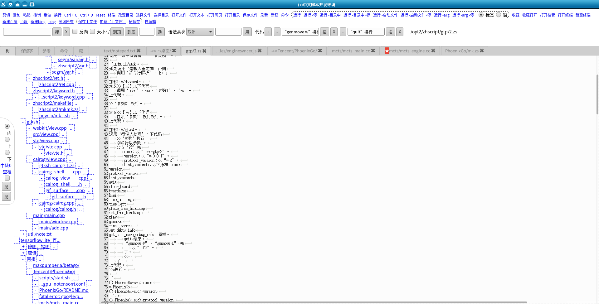
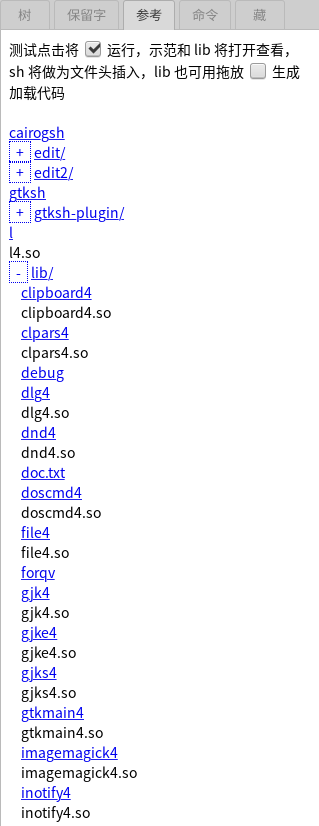
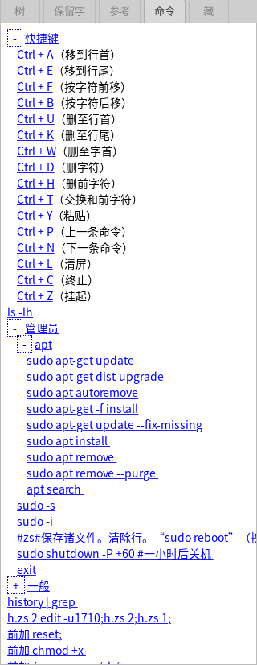

# 二进制、测试代码和开发环境

* 让能够直观、整体地了解这多个项目
* zhscript2 在 ubuntu 1804 64 下编译

这其实算是个全貌目录，
因为那些 lib、sh 项目都无法单独运行（需要解释器），
测试、实用脚本、开发环境（由 sh + 脚本）也需要有个放置的地方。
还有生成整个所需二进制的 makefile

##### 开发环境
运行：./zhscript2/edit/ui
###### 界面

###### 树
怎么组织项目才能够既容易又灵活？“树”是我的一种尝试，按照打开的历史来形成项目。

一般是以目录为封闭单元来构成项目，这种项目需要配置，而一旦配置固定后，跨项目、项目交叉中出现的文件便成为麻烦，而项目里包含另外项目有时也会冲突。
###### 保留字页

###### 参考页

###### 命令页

